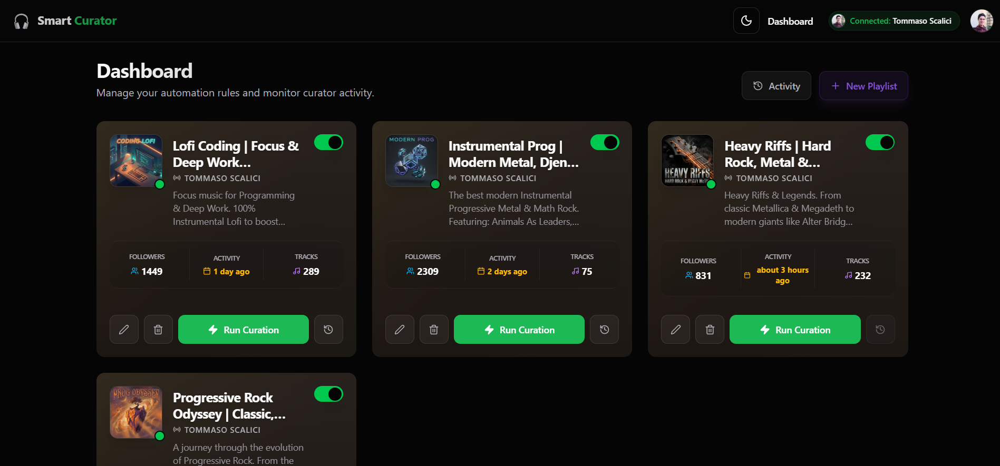

# Smart Spotify Playlist Curator

> **Status**: v1.7.0 | **License**: MIT
> **Stack**: React 19, Node 24, Firebase Gen 2, Gemini 2.5 Flash

A powerful **Private Playlist Utility** that curates Spotify playlists for you and your friends using **Google Gemini 2.5 Flash**. Designed as a self-hosted tool for small groups (up to 25 users).

---

## 🚀 Key Features

### 🧠 AI-Powered Curation

- **Context-Aware Recommendations**: Uses Gemini 2.5 Flash to generate tracks based on "Vibe", "Genre", or complex prompts (e.g., "Songs for a rainy cyberpunk drive").
- **Sonic Consistency**: Uses AI-driven analysis to infer track characteristics and ensure "vibe" consistency without relying on restricted Audio Features APIs.
- **Smart Slot Management**: Intelligently mixes "VIP" (Mandatory) tracks with AI suggestions while preserving the user's preferred order.

### 🛡️ Enterprise-Grade Reliability

- **Orchestrator Pattern**: Decoupled architecture where HTTP triggers only initiate workflows; Orchestrators handle the complex logic.
- **Dry-Run Mode**: Simulate playlist updates without touching your actual library.
- **Rate-Limit Handling**: Robust retry logic with exponential backoff for Spotify API `429` errors.
- **Optimized Concurrency**: Parallel execution for read-heavy operations (e.g., dashboard loading) while maintaining strict sequential consistency for playlist updates.
- **Observability**: Structured JSON logging via `firebase-functions/logger` with correlation IDs.

### 🎨 Premium User Experience

- **Music Studio UI**: built with **React 19**, **Tailwind CSS v4 (CSS-first config)**, and **shadcn/ui**.
- **Real-Time Feedback**: Optimistic UI updates for a snappy feel.
- **Security**: OAuth 2.0 Identity Linking (Spotify) + Firebase Authentication.

### 📸 Screenshots


_Professional-grade dashboard for managing automated playlists._

### 👥 Onboarding Friends

Since this is a private tool using the Spotify API in Development Mode:

1.  Go to your [Spotify Developer Dashboard](https://developer.spotify.com/dashboard).
2.  Add your friends' Spotify Email Addresses to the **Users and Access** whitelist.
3.  They can now log in to your deployed Web App and link their accounts!

---

## 🛠 Tech Stack

- **Runtime**: Node.js `v24` (LTS)
- **Language**: TypeScript `v5.9` (Strict Mode)
- **Frontend**: React `v19` + Vite `v6`
- **Backend**: Firebase Cloud Functions (Gen 2)
- **Database**: Cloud Firestore (NoSQL)
- **Validation**: Zod `v4` (Contract-first design)
- **Testing**: Vitest (Monorepo-wide)
- **Linting**: ESLint `v10` (Flat Config)

---

## 📦 Project Structure (Monorepo)

| Workspace        | Description                                           |
| :--------------- | :---------------------------------------------------- |
| **`functions/`** | Backend Business Logic and API Integration.           |
| **`web-app/`**   | React Frontend. The "Command Center" for users.       |
| **`shared/`**    | Shared Types and Zod Schemas. Single source of truth. |
| **`scripts/`**   | Maintenance and Automation scripts (Seeding, Tokens). |

---

## ⚙️ Usage & Configuration

### 1. Prerequisites

- **Node.js v24**
- **Firebase CLI**: `npm install -g firebase-tools`
- **Spotify Developer App**: [Create Here](https://developer.spotify.com/dashboard).
- **Google AI Studio Key**: [Get Key](https://aistudio.google.com/).

### 2. Installation

```bash
# Clone the repository
git clone https://github.com/TommasoScalici/smart-spotify-playlist-curator.git
cd smart-spotify-playlist-curator

# Install dependencies (Root level)
npm install
```

### 3. Application Setup

You need **Firestore** enabled in your Firebase Project.

1.  **Configure Environment**:
    - **Development**: Copy `.env.example` to `.env` in `functions/` and `web-app/`.
    - **Production**: Use Google Cloud Secret Manager.

2.  **Generate Spotify Refresh Token** (Optional helper):
    _Use this if you need to manually inspect tokens, otherwise the Web App handles auth._

    ```bash
    cd scripts
    npm run get-refresh-token
    ```

3.  **Run Locally (Frontend)**:

    ```bash
    cd web-app
    npm run dev
    ```

4.  **Run Backend Tests**:
    ```bash
    cd functions
    npm test
    ```

---

## 🚀 Deployment

We use **GitHub Actions** for CI/CD, but you can deploy manually:

```bash
# Deploy Backend (Functions + Security Rules)
npm run deploy

# Deploy Frontend (Hosting)
cd web-app
npm run build
firebase deploy --only hosting
```

---

## 🤝 Contributing

**Zero `any` Policy**: We enforce strict TypeScript rules.

1.  Fork the repo.
2.  Create your feature branch (`git checkout -b feature/amazing-feature`).
3.  Commit your changes (`git commit -m 'feat: add amazing feature'`).
    - _Note: We use Conventional Commits. `@semantic-release` automatically processes these to generate version bumps._
4.  Run tests locally (`npm run test` and `npm run type-check`).
5.  Push to the branch.
6.  Open a Pull Request.

---

## 📄 License

Distributed under the MIT License. See [LICENSE](LICENSE) for more information.
