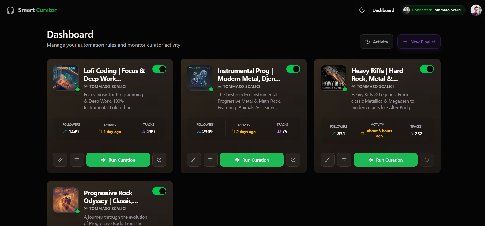

# Smart Spotify Playlist Curator

> **Status**: v1.15.1 | **License**: MIT
> **Stack**: React 19, Vite, Tailwind CSS v4, Node 24, Firebase Gen 2, Gemini 3.8 Flash

A cutting-edge **Private Playlist Utility** that automatically curates, maintains, and refreshes Spotify playlists using **Google Gemini 3.8 Flash** (with automatic fallback to Gemini 3.5 Flash-Lite) and **Firebase Cloud Functions (Gen 2)** for serverless orchestration. Built with a SaaS-first multi-tenant architecture, optimized as a self-hosted tool for private groups (up to 25 users in Spotify Developer Mode).

---

## 🚀 Key Features

### 🧠 AI-Powered Curation

- **Dual-Model Strategy & Auto-Fallback**: Defaults to **Google Gemini 3.8 Flash** (`gemini-3.8-flash`) for deep musical intelligence and nuance, with **Gemini 3.5 Flash-Lite** (`gemini-3.5-flash-lite`) as a high-speed alternative and automatic fallback.
- **Native Structured Output**: Powered by the official `@google/genai` SDK with strict JSON schema definitions (`Type.OBJECT` / `Type.ARRAY`) and system instructions, eliminating hallucinations and JSON parsing errors.
- **Context-Aware Prompts & Style Anchors**: Dynamically generates prompts from playlist titles, user descriptions, style keywords, and configured **Reference Artists** (style anchors).
- **AI Reference Artist Discovery**: Built-in helper to automatically suggest complementary reference artists directly from the UI (`suggestReferenceArtists`).
- **Instrumental-Only Filtering**: Dedicated constraint toggle to ensure recommendations are strictly instrumental (no vocals).
- **Strict Negative Constraints**: System prompts filter out live cuts, remixes, radio edits, remasters, acoustic adaptations, and commentary unless explicitly allowed.
- **Auditable Reasoning**: The AI generates a clear musical rationale for every recommended track.

### 🎛️ Precision Curation Engine & Slot Management

- **Track Freshness & Normalization (`TrackCleaner`)**: Sanitizes track URIs (`spotify:track:...`), removes duplicate single vs. album editions, cleans edition suffixes, and filters tracks older than `maxTrackAgeDays`.
- **VIP Track Protection (`SlotManager`)**: Locks mandatory tracks in fixed index slots or pinned ranges, preserving custom track ordering.
- **Anti-Adjacency & Artist Diversity**: Enforces `maxTracksPerArtist` caps and prevents consecutive same-artist tracks.
- **Configurable Overflow Strategies**: Intelligently trims excess tracks using `drop_random`, `drop_oldest`, `drop_newest`, `drop_most_popular`, or `drop_least_popular`.
- **Diff-Driven Updates (Minimal Mutations)**: Uses `DiffCalculator` to compute the minimum set of additions and removals rather than wiping the playlist, preserving original "Date Added" timestamps, follower feeds, and playlist history.
- **Dry-Run & Estimation**: Simulates and previews exact changes (incoming, outgoing, retained) in real time before touching live Spotify playlists.

### 🛡️ Enterprise-Grade Reliability & Security

- **Server-Side API Boundaries**: The frontend **never** calls Spotify directly and has zero access to client secrets; all Spotify access tokens, refreshes, and API operations are securely proxied via Cloud Functions.
- **OAuth 2.0 with CSRF State**: Secure Spotify authentication flow featuring cryptographic CSRF state verification and seamless Firebase Authentication identity linking.
- **Strict Contract Enforcement**: End-to-end type safety using **Zod v4** validation schemas across all RPC boundaries, form inputs, and Firestore reads.
- **Rate-Limit Resilience**: Internal retry mechanism (`executeWithRetry`) with exponential backoff and jitter for Spotify API `429` responses.
- **Concurrency Locking**: Server-side timestamp locking (`isCurating`) protects against race conditions and concurrent mutation conflicts.
- **Structured Observability**: Correlated JSON logging via `firebase-functions/logger` and real-time Firestore activity logs.

### 🎨 Modern Music Studio UI

- **React 19 & Tailwind CSS v4**: Built with CSS-first configuration, micro-typography tokens (`text-2xs`, `text-3xs`), elevation glow effects, and glassmorphic panels (`glass-card`, `glass-panel`).
- **Component Primitives**: Powered by `shadcn/ui`, `lucide-react`, and `class-variance-authority` (CVA) variants.
- **Atomic Layout Architecture**: Modular components (`Header`, `BrandLogo`, `MobileNavSheet`, `SpotifyStatusBadge`, `UserAccountMenu`, `UnlinkAccountDialog`).
- **Real-Time Synchronisation & Optimistic UI**: Powered by **TanStack Query v5** and Firestore subscriptions for instant mutation feedback and live activity streams.
- **Interactive Diff Viewer & Metrics**: Visual breakdown of playlist diffs alongside deep analytics (genre distribution, release eras, artist diversity).

---

## 📸 Screenshots


_Professional-grade dashboard for managing automated playlists._

---

## 👥 Onboarding Friends

Since this tool uses the Spotify API in Development Mode:

1. Go to your [Spotify Developer Dashboard](https://developer.spotify.com/dashboard).
2. Select your app and navigate to **Users and Access**.
3. Add your friends' Spotify Email Addresses to the whitelist.
4. They can now log in to your deployed Web App and link their Spotify accounts!

---

## 🛠 Tech Stack

| Layer                    | Technology               | Version / Configuration                                                              |
| :----------------------- | :----------------------- | :----------------------------------------------------------------------------------- |
| **Runtime**              | Node.js                  | `v24` (LTS)                                                                          |
| **Language**             | TypeScript               | `v5.9` (Strict Mode, Composite Projects)                                             |
| **AI Engine**            | Google Gemini            | `gemini-3.8-flash` (default), `gemini-3.5-flash-lite` (fallback) via `@google/genai` |
| **Backend (FaaS)**       | Firebase Cloud Functions | Gen 2, Region `us-central1`, Memory 512MiB+                                          |
| **Frontend**             | React                    | `v19` + Vite `v8`                                                                    |
| **Styling**              | Tailwind CSS             | `v4` (CSS-first `@theme`) + `shadcn/ui` + CVA                                        |
| **State Management**     | TanStack Query           | `v5` (Optimistic UI & Cache invalidation)                                            |
| **Database**             | Cloud Firestore          | User-Centric Schema: `users/{uid}/playlists`                                         |
| **Schema Validation**    | Zod                      | `v4` (Contract-first shared schemas)                                                 |
| **Testing**              | Vitest                   | `v4` (Workspace-native runner for Unit & Integration)                                |
| **Linting & Formatting** | ESLint & Prettier        | ESLint `v10` (Flat Config), Prettier `v3`                                            |
| **Versioning**           | semantic-release         | Conventional Commits & Automated Changelogs                                          |

---

## 📦 Project Structure (Monorepo)

```text
/
├── functions/       # Backend Business Logic (Firebase Cloud Functions Gen 2)
│   ├── src/
│   │   ├── admin/       # Firebase Admin & Environment Configuration
│   │   ├── controllers/ # onCall RPC Handlers (Zod contract validation)
│   │   ├── core/        # Curation Orchestrator, SlotManager, TrackCleaner, DiffCalculator
│   │   ├── services/    # SpotifyService, AiService, AuthService
│   │   └── index.ts     # Entry Point & Gen 2 Trigger Exports
│   └── tests/           # Unit & Integration Test Suite
│
├── web-app/         # Modern Studio UI (React 19 + Tailwind v4)
│   ├── src/
│   │   ├── components/  # Layout (Header, BrandLogo, Nav) & shadcn/ui Primitives
│   │   ├── features/    # Feature Modules (Playlists, Dashboard, Auth, Spotify)
│   │   ├── contexts/    # AuthContext, ThemeProvider
│   │   ├── services/    # Firestore & Cloud Functions Callers
│   │   └── lib/         # Form & Utility Helpers
│   └── public/          # Static Assets
│
├── shared/          # Central Knowledge Base & Shared Schemas
│   ├── src/
│   │   ├── schemas/     # Zod Schemas (Config, Tracks, User, Metrics, Search)
│   │   └── index.ts     # Central Exports & AI Model Constants
│   └── dist/            # Compiled TypeScript Declarations
│
└── scripts/         # Operations, Diagnostics & Maintenance
    └── src/
        ├── admin/       # Curation & Spotify Diagnostic Analyzers, Build Helpers
        ├── ai/          # Gemini Model Listing & Verification Scripts
        └── auth/        # Spotify Refresh Token Generation Helper
```

---

## ⚡ Cloud Functions Endpoints

All endpoints are hosted on Cloud Functions Gen 2 (`us-central1`) and strictly enforce Zod runtime schemas:

| Endpoint                  | Trigger           | Description                                                                            |
| :------------------------ | :---------------- | :------------------------------------------------------------------------------------- |
| `exchangeSpotifyToken`    | `onCall` (Public) | Handles OAuth authorization code exchange with CSRF state verification.                |
| `triggerCuration`         | `onCall` (Auth)   | Runs the complete curation pipeline (clean, generate AI tracks, slot, apply diff).     |
| `estimateCuration`        | `onCall` (Auth)   | Dry-run simulation that calculates diffs and previews tracks without mutating Spotify. |
| `suggestReferenceArtists` | `onCall` (Auth)   | Uses Gemini to discover and recommend reference artists based on playlist context.     |
| `getPlaylistMetrics`      | `onCall` (Auth)   | Calculates track count, freshness, diversity, and genres for a playlist.               |
| `searchSpotify`           | `onCall` (Auth)   | Secure server-side proxy search for tracks and artists.                                |
| `getTrackDetails`         | `onCall` (Auth)   | Fetches complete metadata for specific Spotify track IDs.                              |

---

## ⚙️ Setup & Configuration

### 1. Prerequisites

- **Node.js**: `v24` (LTS)
- **Firebase CLI**: `npm install -g firebase-tools`
- **Spotify Developer App**: [Create an app](https://developer.spotify.com/dashboard)
  - Configure Redirect URI: `http://localhost:8888/callback` (or your production hosting domain)
- **Google AI Studio API Key**: [Get an API Key](https://aistudio.google.com/)

### 2. Installation

```bash
# Clone the repository
git clone https://github.com/TommasoScalici/smart-spotify-playlist-curator.git
cd smart-spotify-playlist-curator

# Install dependencies across all workspaces
npm install
```

### 3. Environment Configuration

Copy `.env.example` to `.env` in the root (and in workspace directories as needed):

```bash
cp .env.example .env
```

Key variables to populate:

- `SPOTIFY_CLIENT_ID` & `SPOTIFY_CLIENT_SECRET`: From your Spotify Developer Dashboard.
- `SPOTIFY_REDIRECT_URI`: OAuth callback URL.
- `GOOGLE_AI_API_KEY`: API key for Gemini 3.8 Flash / 3.5 Flash-Lite.
- `VITE_FIREBASE_*`: Firebase Web App client configuration from Firebase Console.
- `GOOGLE_APPLICATION_CREDENTIALS`: Path to your service account JSON (for local administrative scripts).

---

## 💻 Development & Workflow

### Development Scripts

| Command                   | Workspace | Description                                                                |
| :------------------------ | :-------- | :------------------------------------------------------------------------- |
| `npm run dev`             | `web-app` | Starts the Vite development server with Hot Module Replacement.            |
| `npm run type-check`      | Monorepo  | Compiles `shared` workspace and runs `tsc -b` composite type check.        |
| `npm test`                | Monorepo  | Executes Vitest across all workspaces (`shared`, `web-app`, `functions`).  |
| `npm run lint`            | Monorepo  | Runs ESLint v10 flat config across all workspaces.                         |
| `npm run fix`             | Monorepo  | Runs `type-check`, ESLint `--fix`, and Prettier formatting in sequence.    |
| `npm run deploy-firebase` | Monorepo  | Compiles functions bundle via `build.ts` and triggers Firebase deployment. |

### Operational & Diagnostic Scripts

The `scripts/` package provides utilities for local maintenance and diagnostics:

```bash
# Generate Spotify refresh token interactively
npm run get-refresh-token --workspace=scripts

# Verify Gemini AI connection and list available models
npx tsx scripts/src/ai/verify-ai.ts
npx tsx scripts/src/ai/list-models.ts

# Run curation diagnostic analysis
npx tsx scripts/src/admin/analyze-curation.ts
```

---

## 🚀 Deployment

Deployments are automated through **GitHub Actions** upon merging into `main`, but can also be executed manually:

```bash
# Full deployment (Hosting + Functions + Rules + Indexes)
npm run deploy-firebase

# Deploy only Frontend Hosting
firebase deploy --only hosting

# Deploy only Backend Cloud Functions
firebase deploy --only functions
```

---

## 🤝 Contributing

We enforce a strict **Zero `any` Policy** and contract-first schema design:

1. Fork the repository and create your feature branch (`git checkout -b feat/my-enhancement`).
2. Implement your changes adhering to [Developer & Architecture Guide](.agent/rules/code-style-guide.md).
3. Validate locally:
   ```bash
   npm run fix
   npm test
   ```
4. Commit your changes using **Conventional Commits**:
   - `feat: ...` -> Triggers Minor release (e.g., `v1.16.0`)
   - `fix: ...` -> Triggers Patch release (e.g., `v1.15.2`)
   - `chore: ...` -> Maintenance without release
5. Push to your branch and open a Pull Request.

---

## 📄 License

Distributed under the MIT License. See [LICENSE](LICENSE) for details.
