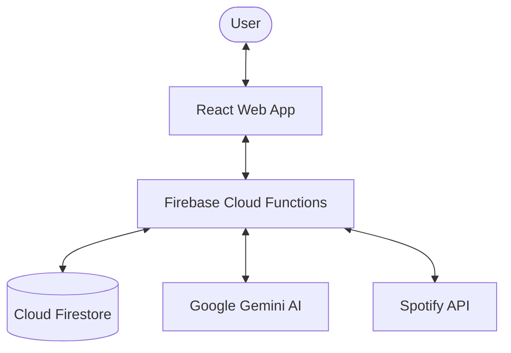

# System Architecture Overview

The Smart Spotify Playlist Curator is built as a modern, serverless monorepo that bridges AI intelligence with Spotify's music catalog.

## 📐 High-Level Architecture

### 1. Frontend (`web-app/`)

The "Command Center" where users configure their playlists and trigger curations.

- **Framework**: React 19 + Vite.
- **Data Sync**: Real-time subscriptions to Firestore logs for live progress.
- **Security**: Authenticated via Firebase Auth.

### 2. Backend (`functions/`)

The orchestration layer that handles heavy lifting and sensitive integrations.

- **Runtime**: Node 24 (bundled via Esbuild).
- **Triggers**: HTTPS `onCall` functions.
- **Orchestration**: Manages the complex flow of scanning, cleaning, and updating playlists.

### 3. Intelligence (`AiService`)

Uses **Gemini 2.5 Flash** to provide the "Smart" in the curator.

- **Prompting**: Uses Chain-of-Thought and Native Structured Output.
- **Knowledge**: Relies on AI's internal music knowledge to bypass Spotify API limitations.

### 4. Shared Layer (`shared/`)

The "Glue" that ensures type safety across the entire stack.

- **Contract**: Zod schemas for all cross-boundary communication.
- **Types**: Shared TypeScript interfaces.

## 🔄 Core Data Flow: Playlist Curation

1.  **Trigger**: User clicks "Curate Now" in the UI.
2.  **Auth**: Backend validates Firebase ID token and exchanges stored Refresh Token for a Spotify Access Token.
3.  **Audit**: `PlaylistOrchestrator` fetches current tracks and metadata.
4.  **Generation**: AI generates new track suggestions based on the playlist's "Vibe" and reference artists.
5.  **Reconciliation**: `SlotManager` merges existing tracks, VIPs, and new AI suggestions.
6.  **Execution**: `SpotifyService` performs a smart, diff-based update to the Spotify playlist.
7.  **Logging**: Every step is logged to Firestore for real-time UI updates.
